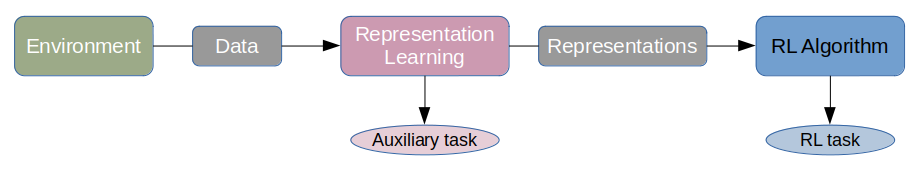
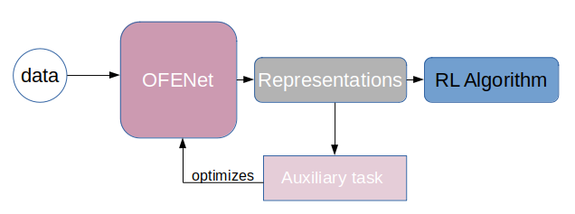

# Master Thesis & Code
In this GitHub repository is my master thesis and the code I used for the experiments on the topic "**A Comparison of Auxiliary Tasks for Low-Dimensional Representation Learning**".

I implemented the Online Feature Extractor Network (OFENet) by Ota et al. (https://arxiv.org/abs/2003.01629) in PyTorch and 
combined it with TD3 and SAC.

The Code for TD3 is based on the original Code by Fujimoto et al. (https://arxiv.org/abs/1802.09477).
The Code for SAC is based on the PyTorch implementation by Yarats et al. (https://github.com/denisyarats/pytorch_sac).

The folders TD3 and SAC each contain a version with and without OFENet including a separate readme, which explains how to use the particular version.

Put simply, RL algorithms receive data from an environment as input and perform an action as output, usually to fulfill a specific task. 

This data can either be used raw or preprocessed, for example to filter out certain information in advance (with the help of an auxiliary task) or to simplify the data. This pre-processing is also referred to as representation learning and can either be integrated into the actual RL algorithm or be explicitly connected upstream.

One method of representation learning is OFENet (described in more detail in my thesis and in the original paper by Ota et al. (https://arxiv.org/abs/2003.01629)). In my thesis I have now investigated to what extent the use of different auxiliary tasks when learning representations affects the performance of the respective RL algorithm.

